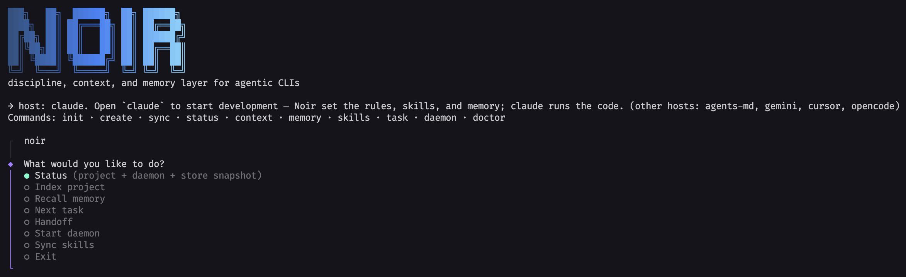

# Noir

> The discipline, context, and memory layer for any agentic CLI — spec-driven workflow, native working-context, and cross-session memory, local-first by default.

[](https://www.npmjs.com/package/@noir-ai/cli)
[](https://github.com/agaaaptr/noir/actions/workflows/ci.yml)
[](https://www.npmjs.com/package/@noir-ai/cli)
[](LICENSE)

The `noir` grouped home menu — section picker + per-section action lists with hints (interactive; `noir status` when non-interactive):



**Noir** is a host-agnostic orchestration layer that makes an agentic CLI behave like a disciplined spec-driven engineer. **Claude Code is the default host; Gemini, Cursor, OpenCode, and AGENTS.md are one `--host` flag away** (bring-your-own-agent). It wires three capabilities every long-running agent loses without help:

1. **Spec-driven workflow** — an escapable, observable lifecycle (idea → spec → plan → implement → verify → document) where every gate decision is recorded.
2. **Native working-context** — a hybrid retrieval engine (BM25 + vector kNN + Reciprocal Rank Fusion) so the host queries small ranked snippets instead of re-reading whole files.
3. **Cross-session memory** — typed, searchable, governable long-term memory; save an insight in one session and recall it in another.

**Noir is an orchestration layer, NOT an LLM runtime.** It contains no agent loop. The optional model layer is single-shot, provider-explicit, and degrades to pure orchestration when no key is set — it never makes a silent paid call.

## Status

<!-- noir:doc:status -->
**Latest stable:** `1.9.3` (npm dist-tag `latest` — `npm i @noir-ai/cli` resolves here)
**Current beta:** `1.9.3-beta.1` (npm dist-tag `beta` — `npm i @noir-ai/cli@beta` to opt in)
**Source version:** `1.9.3` (clean SemVer in `packages/*/package.json`)

*Last auto-generated: 2026-08-10T08:46:40.165Z*
<!-- /noir:doc:status -->

## Quick start

**Recommended — native installer** (managed-Node runtime under `~/.noir/`; no system Node prerequisite, no `sudo`/admin):

```bash
# macOS / Linux
curl -fsSL https://raw.githubusercontent.com/agaaaptr/noir/main/scripts/install.sh | bash
# Windows (PowerShell)
powershell -ExecutionPolicy Bypass -c "irm https://raw.githubusercontent.com/agaaaptr/noir/main/scripts/install.ps1 | iex"
```

Then:

```bash
noir init                        # scaffold .noir/ + 27 skills + host wiring
noir                             # open the home menu (screenshot above)
```

Other install paths (npm/pnpm/yarn/bun, npx one-shot, Homebrew, Scoop), beta channel, `noir install`/`migrate`, and `noir update` → [Installation](docs/how-to/installation.md).
First-use walkthrough → [Getting Started](docs/getting-started.md).

## What's in the box

An 11-package pnpm monorepo, all `@noir-ai/*`:

| Package | Role |
|---|---|
| `@noir-ai/core` | Shared types, config schema, `.noir/` layout |
| `@noir-ai/store` | Embedded SQLite + FTS5 + sqlite-vec |
| `@noir-ai/workflow` | SDD lifecycle FSM engine |
| `@noir-ai/skills` | 26 native `noir-*` skills + integration + compiler with quality gate |
| `@noir-ai/context` | Hybrid retrieval: BM25 + vector kNN + RRF |
| `@noir-ai/memory` | Cross-session memory with governance |
| `@noir-ai/model` | Optional single-shot completion layer |
| `@noir-ai/daemon` | Runtime authority + MCP server |
| `@noir-ai/adapters` | 5 host adapters (Claude, Gemini, Cursor, OpenCode, AGENTS.md) |
| `@noir-ai/cli` | The `noir` command tree |
| `@noir-ai/create` | Scaffold engine (init/sync/create) |

Full inventory → [Package Reference](docs/reference/packages.md).

## The `noir` CLI

```
noir init [--host <id>]         scaffold .noir/ + skills + host wiring
noir sync                       re-emit skills + host config
noir create [dir]               AI-layer scaffold
noir status                     probe-only health (daemon-down safe)
noir doctor                     config / store / embedder / deps / install
noir daemon start|stop|status|restart  persistent MCP server
noir context {search,index,status}     hybrid retrieval
noir memory {recall,save,sessions,forget,consolidate}  cross-session memory
noir task {new,next,status,advance}    SDD workflow
noir skills {list,sync}                builtin skills
noir install|migrate [spec]     native install / migrate from another method
noir update [spec]              self-update via the active install method
noir handoff                    pasteable host handoff artifact
noir wrap                       session-end handoff alias
noir palette                    fuzzy command palette — run any command (Ink)
noir tui                        interactive Ink dashboard
```

Full reference → [CLI Reference](docs/reference/cli.md).  
MCP tools → [MCP Tools Reference](docs/reference/mcp-tools.md).

## Documentation

| | |
|---|---|
| **Tutorial** | [Getting Started](docs/getting-started.md) |
| **How-to** | [Installation](docs/how-to/installation.md) · [Releasing](docs/how-to/releasing.md) · [Adding a Package](docs/how-to/packaging.md) |
| **Reference** | [CLI Commands](docs/reference/cli.md) · [Configuration](docs/reference/config.md) · [MCP Tools](docs/reference/mcp-tools.md) · [Skills](docs/reference/skills.md) · [Packages](docs/reference/packages.md) |
| **Explanation** | [Architecture](docs/explanation/architecture.md) · [Privacy](docs/explanation/privacy.md) · [SDD Workflow](docs/explanation/sdd-workflow.md) |
| **Records** | [Roadmap](docs/roadmap/) · [Changelog](CHANGELOG.md) · [Decisions (ADRs)](docs/decisions/) |

## Development

```bash
pnpm install && pnpm build    # build all 11 packages
pnpm lint && pnpm typecheck    # lint + type checks
pnpm test                       # vitest suite (Node ≥22)
```

This repo is developed with Claude Code; [AGENTS.md](AGENTS.md) holds the conventions.

## License

[MIT](LICENSE) — true OSS.
